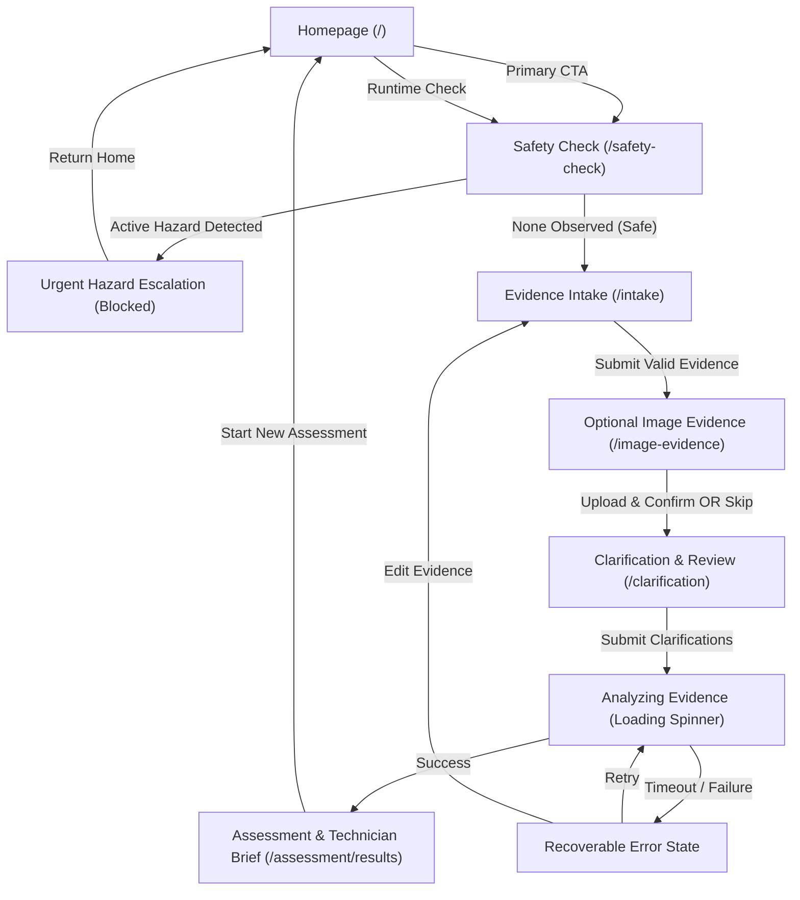

# SolarResolve Official Visual & Interaction Design System
## Comprehensive Figma Specification and Developer Handoff Manual

**Version:** 2.0 (Official Production Standard)  
**Date:** September 23, 2026  
**Status:** Approved for Implementation  
**Audience:** Lead Product Designer, UI/UX Engineers, Frontend React Developers  
**Brand Source of Truth:** `SolarResolve-Official-Identity-V2-P6-2026-09-23/`  
**Identity Specification:** V2 Wide Evidence Mark · P6 Earth & Saffron Palette  

---

## 1. Executive Summary & Design Principles

SolarResolve is a safety-aware decision-support tool for Nigerian solar owners experiencing declining battery runtime. It helps owners organize fragmented observations, separate facts from possibilities, complete only low-risk checks, and generate a structured, technician-ready brief.

### 1.1 Non-Negotiable Product Truths
1. **Decision Support, Not Diagnosis:** SolarResolve never provides a definitive component diagnosis (e.g., "Your battery is dead"), assigns speculative "health scores", or replaces a qualified professional.
2. **Deterministic Safety First:** Every assessment flow begins with mandatory urgent hazard screening (`/safety-check`). Active hazards halt ordinary intake immediately.
3. **No Marketplace or Commercial Incentives:** SolarResolve does not sell solar equipment, compare quotes, benchmark installer pricing, or act as an installer directory.
4. **Honest Proof & Plain Language:** No fake testimonials, fabricated customer counts, countdown timers, or marketing urgency.

### 1.2 Core Experience Character
- **Grounded & Calm:** Replaces solar anxiety with quiet, methodical clarity.
- **Evidence-Led:** Distinguishes verified user observations, confirmed image readings, and AI hypotheses.
- **Hardware-Aware & Practical:** Designed for real Nigerian field conditions, smartphone touch screens, and low-bandwidth resilience.

---

## 2. Canonical Brand Tokens (P6 Earth & Saffron)

The earlier forest-green palette (`#07372B`, `#0B4D3B`, `#F4B43A`) was a temporary exploration. The approved and controlling brand standard is **P6 Earth & Saffron**.

### 2.1 Color Token Dictionary

```css
:root {
  /* Brand Surfaces & Primary Elements */
  --sr-earth: #4a2d22;             /* Header, hero, major dark cards, wordmark */
  --sr-earth-dark: #352018;        /* Darker hover states, active dark surfaces */
  --sr-earth-subtle: #24140e;      /* Deep contrast borders on dark surfaces */
  
  /* Brand Energy Accent */
  --sr-saffron: #f2c14e;           /* Primary action buttons, solar lens core, key data */
  --sr-saffron-hover: #e5b33d;     /* Primary action hover state */
  --sr-saffron-active: #d4a22c;    /* Primary action pressed state */
  --sr-saffron-glow: rgba(242, 193, 78, 0.18); /* Accent halos on dark surfaces */
  
  /* Ground & Neutral Surfaces */
  --sr-warm-ground: #fbf7ef;       /* Global page background */
  --sr-surface: #ffffff;           /* Cards, input backgrounds, modal surfaces */
  --sr-surface-subtle: #f5efe4;    /* Table headers, neutral badges, card insets */
  
  /* Typography & Contrast */
  --sr-energy-ink: #2b211d;        /* Primary body copy, headers on light, text on saffron */
  --sr-muted: #766962;             /* Secondary text, metadata, field labels */
  --sr-subtle: #9d9089;            /* Placeholder text, disabled labels */
  --sr-soft-line: #e2d9d1;         /* Dividers, field borders, card strokes */
  --sr-on-earth: #ffffff;          /* Primary text on Solar Earth */
  --sr-on-earth-muted: #d6cbc5;    /* Secondary text on Solar Earth */
  --sr-on-saffron: #2b211d;        /* STRICT: Always dark ink on saffron buttons */
  
  /* Semantic Status & Safety System */
  --sr-success: #397a55;           /* Confirmed facts, safe status, evidence verified */
  --sr-success-tint: #e9f4ed;      /* Background tint for confirmed items */
  --sr-information: #2f6e7c;       /* Missing info, notes, helpful context */
  --sr-information-tint: #e8f2f4;  /* Background tint for informational banners */
  --sr-warning: #b76a00;           /* Attention recommended, uncertain observation */
  --sr-warning-tint: #fff3d7;      /* Background tint for warnings */
  --sr-danger: #b33a3a;            /* Urgent hazard, prohibited action, error */
  --sr-danger-tint: #f9e9e7;       /* Background tint for emergency escalation */
  
  /* Accessible Focus */
  --sr-focus-ring: #2867b2;        /* High-contrast keyboard focus indicator */
}
```

### 2.2 Accessibility & Contrast Validation
- **White (`#FFFFFF`) on Solar Earth (`#4A2D22`):** **12.43:1** (Exceeds WCAG AAA for all text sizes).
- **Energy Ink (`#2B211D`) on Solar Saffron (`#F2C14E`):** **9.35:1** (Exceeds WCAG AAA for all text sizes).
- **CRITICAL ACCESSIBILITY RULE:** Never place white text on Solar Saffron buttons. White on Saffron yields only 1.33:1 contrast and causes an immediate WCAG AA failure.

### 2.3 Typography Scale & Font Families

| Role | Font Family | Fallback Stack | Weights | Usage |
| :--- | :--- | :--- | :--- | :--- |
| **Headings & Wordmark** | General Sans | 'Source Sans 3', 'Segoe UI', sans-serif | 600 (Semibold), 700 (Bold) | H1–H4, Brand Titles |
| **Body & Form Controls** | Source Sans 3 | 'Segoe UI', -apple-system, sans-serif | 400 (Regular), 600 (Semibold) | Body, Labels, Actions, Alerts |
| **Data & Readings** | Geist Mono | 'Cascadia Mono', Consolas, monospace | 500 (Medium), 600 (Semibold) | Runtimes, Watts, Codes, Numbers |

#### Type Scale Specifications:
- **Display 1 (Desktop Hero H1):** `48px` / `52px` line-height / `-0.035em` tracking / General Sans 700
- **Display 2 (Section H2):** `32px` / `38px` line-height / `-0.025em` tracking / General Sans 700
- **Display 3 (Card H3):** `22px` / `28px` line-height / `-0.015em` tracking / General Sans 600
- **Subheading (H4):** `18px` / `24px` line-height / `0em` tracking / General Sans 600
- **Body Large:** `18px` / `28px` line-height / Source Sans 3 400
- **Body Standard:** `16px` / `24px` line-height / Source Sans 3 400
- **Body Small / Caption:** `14px` / `20px` line-height / Source Sans 3 400
- **Eyebrow / Overline:** `12px` / `16px` line-height / `0.08em` tracking / Uppercase / Source Sans 3 700
- **Technical Metric Large:** `32px` / `36px` line-height / Geist Mono 600
- **Technical Metric Standard:** `16px` / `22px` line-height / Geist Mono 500

### 2.4 Spacing, Corner Radius, and Shadows
- **Base Spatial Unit:** 4px
- **Scale:** `4px` (`--space-1`), `8px` (`--space-2`), `12px` (`--space-3`), `16px` (`--space-4`), `24px` (`--space-6`), `32px` (`--space-8`), `48px` (`--space-12`), `64px` (`--space-16`), `96px` (`--space-24`).
- **Corner Radii:**
  - Control / Field / Button: `8px` (`--sr-radius-control`)
  - Content Cards / Sections: `12px` (`--sr-radius-card`)
  - Large Hero Proof / Panels: `16px` (`--sr-radius-panel`)
  - Chips / Pills / Badges: `999px` (`--sr-radius-pill`)
- **Elevation Shadows:**
  - Standard Card: `0 1px 3px rgba(43, 33, 29, 0.06), 0 8px 24px rgba(43, 33, 29, 0.08)`
  - Elevated / Focus Card: `0 4px 12px rgba(43, 33, 29, 0.1), 0 16px 40px rgba(43, 33, 29, 0.12)`
  - Interactive Hover: `translateY(-2px)` with `0 6px 16px rgba(43, 33, 29, 0.12)`

---

## 3. Official Logo Placement & Vector Rules

The official identity direction is **V2 Wide Evidence**, featuring a wide battery geometry enclosing a focused optical lens with a circular Solar Saffron energy core.

### 3.1 Supplied Vector Variants & Usage Mapping

| Vector Asset | Context & Surface | Color Treatment | Minimum Dimensions |
| :--- | :--- | :--- | :--- |
| `solarresolve-official-horizontal.svg` | Light surfaces (`#FFFFFF`, `#FBF7EF`) | Solar Earth `#4A2D22` battery, lens, & wordmark; Saffron `#F2C14E` core | Width `150px` (Web), `35mm` (Print) |
| `solarresolve-official-horizontal-reversed.svg` | Dark surfaces (`#4A2D22`, `#352018`) | White `#FFFFFF` battery, lens, & wordmark; Saffron `#F2C14E` core | Width `150px` (Web), `35mm` (Print) |
| `solarresolve-official-mark.svg` | Favicon, app icon, compact mobile header | Solar Earth outline or White on dark; Saffron core | Width `24px` × `24px` |
| `solarresolve-official-monochrome.svg` | Single-color production, thermal print, stamps | 100% Energy Ink `#2B211D` or 100% Black | Width `150px` |

### 3.2 Clear Space & Geometric Guardrails
- **Clear Space:** Maintain an exclusion perimeter equal to the diameter of the inner Saffron circular core around all four sides.
- **Prohibited Modifications:**
  - Do not add lightning bolts, rays, energy waves, drop shadows, or glow effects.
  - Do not rotate or skew the mark.
  - Do not recolor the Saffron core with green or red status indicators.
  - Do not alter the proportions between the lens handle and battery body.

---

## 4. Screen-by-Screen Visual Anatomy & Interaction Specifications

### Screen 1: Homepage (`/`)

#### 1. Sticky Header
- **Surface:** Solar Earth `#4A2D22` with `rgba(74, 45, 34, 0.94)` opacity and `backdrop-filter: blur(10px)`.
- **Left:** Official Reversed Logo (`solarresolve-official-horizontal-reversed.svg`), height `36px`.
- **Center Links:** "How it works", "Safety First", "Help" (Color: `#FFFFFF`, hover: `#F2C14E` with 2px underline transition).
- **Right Action:** "Assess my battery" primary button (Saffron `#F2C14E` with dark `#2B211D` text). Target: `/safety-check`.
- **Mobile Behavior (≤ 768px):** Menu toggle button (`44×44px` target) with `aria-expanded` and accessible drawer containing all links.

#### 2. Hero Section
- **Surface:** Deep Solar Earth gradient (`#4A2D22` transitioning to `#352018`) with subtle 40px coordinate grid (`rgba(255,255,255,0.06)`).
- **Left Column:**
  - Status Eyebrow: `SAFETY-AWARE BATTERY-RUNTIME ASSESSMENT` with Saffron pulse dot.
  - H1 Headline: *"Your solar battery does not last like it used to. Turn what changed into a clearer next step."*
  - Supporting Copy: Explains that SolarResolve organizes runtime, loads, and evidence into an actionable technician-ready brief.
  - Primary CTA: *"Assess my battery-runtime problem →"* (Saffron button, links to `/safety-check`).
  - Secondary CTA: *"See a sample assessment"* (Outlined white button, smooth scrolls to `#sample-result`).
  - Assurance Checkmarks: "Starts with a safety check", "Photo is optional", "Decision support, not a diagnosis".
- **Right Column:** Product Output Preview Card (Translucent glass card on Solar Earth showing a structured snapshot of a 10h → 4h case).

#### 3. Supported-Scenario Strip
- **Surface:** Saffron `#F2C14E` background bar with Energy Ink `#2B211D` text.
- **Message:** *"Currently supported: Declining battery runtime (e.g. battery used to last until morning but now shuts down early)."*
- **Anchor Link:** *"What we do not cover ↗"* navigating to the FAQ section.

#### 4. Runtime Change Check (Interactive Utility)
- **Positioning:** Placed immediately beneath the scope strip to provide immediate value without diagnostic claims.
- **Surface:** Elevated White card `#FFFFFF` on Warm Ground `#FBF7EF`.
- **Inputs:**
  - *Previous typical runtime:* Number input with `hours` label.
  - *Current typical runtime:* Number input with `hours` label.
  - *Night-time appliance use:* Segmented chip options (`Yes, it changed`, `No change`, `I am not sure`).
- **Live Output Banner:**
  - *Declined case:* Displays calculated percentage drop (e.g., `57% decline`) with explanatory text: *"Your reported runtime dropped from 7h to 3h. This is meaningful evidence, but does not identify the cause by itself."*
  - *Longer runtime case:* Explains that reported hours increased and invites details in the assessment.
  - *Invalid / Empty:* Prompts for positive values.
- **CTA:** *"Continue with a safety check →"* routes deterministically to `/safety-check`.

#### 5. How It Works (Three-Step Process)
- **Grid:** 3 columns on desktop, stacked on mobile.
- **Step 1:** *Describe what changed* — Tell SolarResolve how runtime compares with past behavior in plain language.
- **Step 2:** *Organize safe evidence* — Add system details, appliance usage, and an optional safe photo.
- **Step 3:** *Take an informed next step* — Receive an assessment separating facts from hypotheses, plus a technician brief.

#### 6. Sample Assessment Output
- **Surface:** Warm Ground `#FBF7EF` container with a dark preview card.
- **Layout:** Quad-split preview card clearly delineating:
  - *What we know:* 10h to 4h drop, no error code displayed, refrigerator & lights connected.
  - *What is missing:* Battery chemistry, daytime charging confirmation, recent load log.
  - *What may be happening:* Load increase, incomplete charging, or capacity loss.
  - *Safe next step:* Record sunset voltage and review night loads without opening gear.

#### 7. Trust Commitments
- 4 clean editorial cards:
  1. *Facts stay separate from possibilities.*
  2. *You confirm the evidence.*
  3. *Safety rules do not depend on AI.*
  4. *A qualified technician remains the authority.*

#### 8. Visible Safety Panel
- **Surface:** Danger tint `#F9E9E7` with `#B33A3A` border and warning icon.
- **Stop Warning:** Lists smoke, fire, severe heat, battery swelling, leaks, hissing, sparks, exposed wires, shock, and water ingress.
- **Mandate:** *"Do not touch, open, disconnect, or attempt to repair the equipment."*

#### 9. FAQ Section
- Accordions using native `<details>` and `<summary>` elements. Covers technician limits, supported scope, photo optionality, and hazard behavior.

#### 10. Truthful Footer
- Links to Help, Privacy Notice, Website Terms. Email contact: `support@solarresolve.com`. No false certifications.

---

### Screen 2: Safety Check (`/safety-check`)

#### Interaction & Routing Rules
- **Entry Gate:** Every assessment CTA routes here first.
- **Options (Multi-select checkboxes):**
  1. `Smoke or fire`
  2. `Burning smell`
  3. `Battery swelling, leaking, hissing, cracking, or physical damage`
  4. `Exposed or sparking conductors`
  5. `Electric shock`
  6. `Severe or unusual heat`
  7. `Water entering electrical equipment`
  8. `None of these observed (safe to proceed)` (Mutually exclusive: selecting this unchecks all others; selecting any hazard unchecks this).

#### Two Distinct Outcomes
- **Outcome A (Hazard-Stop Escalation):**
  - Triggered if ANY hazard is selected.
  - Intake is immediately blocked.
  - Calm, high-urgency card in `#F9E9E7` with `#B33A3A` border.
  - Protocol: Keep a safe distance; Do not touch or disconnect equipment; Contact a qualified professional immediately.
  - Action: "Return to Home" button.
- **Outcome B (Safe to Proceed):**
  - "Continue" button unlocks `/intake`.

---

### Screen 3: Evidence Intake (`/intake`)

#### Layout & Hierarchy
- **Header:** Clear progress indicator (Step 1 of 4: Evidence Intake).
- **Group 1: The Problem (*Required):**
  - Plain-language problem description textarea.
  - Previous runtime (number) + unit dropdown (hours/minutes).
  - Current runtime (number) + unit dropdown (hours/minutes).
  - Change pattern select (`Sudden`, `Gradual`, `I don't know`).
  - When it began text field.
- **Group 2: Charging & System Context:**
  - Does battery reach full charge before evening (`Yes`, `No`, `Sometimes`, `Unknown`).
  - Approximate system age.
  - Inverter brand & model (labeled Optional).
  - Battery brand & model (labeled Optional).
- **Group 3: Appliances & Loads (Appliance Combobox Component):**
  - Detailed below in Section 5.
- **Group 4: Display Reading (Optional):**
  - Explicit warning: *"Only record display readings that are safely visible without opening covers or touching conductors."*

---

### Screen 4: Appliance / Equipment Selector Component Specification

Adapted from the approved interaction pattern to capture consistent connected-load evidence without confusing estimates with electrical measurements.

#### 4.1 Component States & Specifications

| State | Visual Treatment | Interaction / Accessibility |
| :--- | :--- | :--- |
| **1. Empty / Default** | Select combobox button showing: `"Choose an appliance to add…"` with dropdown chevron. | Border `#E2D9D1`, Background `#FFFFFF`. Accessible button with `aria-haspopup="listbox"`, `aria-expanded="false"`. |
| **2. Focused** | Focus ring: 3px solid `#2867B2`, outline offset 2px. | Keyboard focus via `Tab`. `Enter` or `Down Arrow` opens listbox. |
| **3. Open / Searching** | Dropdown panel expands with search filter input and scrollable list. | `aria-expanded="true"`. Filter input auto-focuses. Arrow keys navigate items. |
| **4. Item Highlighted** | Background `#FBF7EF`, font-weight 600. | Shows Appliance Name + Typical Estimated Watts (e.g. `Ceiling fan (70 W)`). |
| **5. Item Selected** | Added as a structured row to the Connected Appliances list. Combobox resets. | Focus returns to combobox button or new row. Live region announces addition. |
| **6. Active Rows List** | Card row with: Appliance Name, Quantity input, Editable Watts input, Night-use hours input, "Recently changed" checkbox, and "Remove" icon button. | All fields fully editable. Stated wattage includes helper text: `Typical estimate. Edit if you know your label value.` |
| **7. Validation Error** | Red border `#B33A3A` on row with message: `Enter a valid quantity and wattage greater than 0.` | `role="alert"` linked via `aria-describedby`. |

#### 4.2 Standard Preset Catalogue

```json
[
  { "name": "LED lighting point", "watts": 10 },
  { "name": "Ceiling fan", "watts": 70 },
  { "name": "Television", "watts": 100 },
  { "name": "Laptop computer", "watts": 60 },
  { "name": "Wi-Fi router", "watts": 15 },
  { "name": "Refrigerator (efficient)", "watts": 150 },
  { "name": "Chest freezer", "watts": 200 },
  { "name": "Water pump (0.75 HP)", "watts": 750 },
  { "name": "Air conditioner (1 HP)", "watts": 900 },
  { "name": "Electric iron", "watts": 1000 },
  { "name": "Electric kettle", "watts": 1500 },
  { "name": "Other custom appliance", "watts": 100 }
]
```

#### 4.3 Deterministic Night Energy Summary Card
Below the active appliance list, a calculation card displays:
- **Total Connected Load:** Sum of `Quantity × Stated Watts` (in Watts).
- **Estimated Night Energy Consumption:** Sum of `(Quantity × Watts × Night Hours) / 1000` (in kWh).
- **Recently Changed Appliances Count:** Number of items with "Recently changed" checked.
- **Labeling Guardrail:** Prominently tagged: *"Estimated connected load based on typical ratings. This is not a measured circuit reading."*

---

### Screen 5: Optional Image Evidence (`/image-evidence`)

#### Safety & User Choice Rules
- **Explicit Exemption:** Big prominent notice: *"Photo evidence is completely optional. You can continue without an image."*
- **Physical Safety Warning:** *"Do not open equipment covers, touch wiring, or enter an awkward or dangerous position to photograph a display."*
- **Permitted Evidence Types:** Safe photos of inverter screen, battery screen, or external spec plate.

#### UI States
1. **Dropzone Default:** Dashed border `#E2D9D1`, camera/upload icon, "Select photo or drag and drop", accepted formats (JPEG, PNG, WebP up to 5MB).
2. **File Selected / Preview:** Displays thumbnail, file name, file size, "Replace" button, and "Remove" button.
3. **Upload / Extraction Loading:** Calm spinner with message: *"Scanning safely visible values..."*
4. **Extraction Review Table:** Displays extracted values with readability tags (`CLEAR`, `UNCERTAIN`, `UNREADABLE`). User must click `Confirm`, `Correct`, or `Reject`.
5. **Continue Button:** Labeled *"Continue Without Photo"* if no file selected; *"Confirm & Continue"* if file processed.

---

### Screen 6: Clarification Screen (`/clarification`)

#### Architecture
- **Header:** Step 3 of 4: Clarification & Evidence Review.
- **Section 1: Summary of Reported Facts:**
  - Categorized breakdown of all user inputs and confirmed image data.
  - Explicit source tagging: `[user]` for owner report, `[image]` for confirmed OCR, `[unconfirmed]` for unreadable values.
- **Section 2: Targeted Plain-Language Questions (Maximum 3–5):**
  - Q1: *"Does the battery usually reach full charge before sunset?"* (`Yes`, `No`, `Sometimes`, `Not sure`)
  - Q2: *"Has any appliance been added or used for longer recently?"* (`Yes`, `No`, `Not sure`)
  - Q3: *"Did this issue begin after any maintenance, repairs, or settings changes?"* (`Yes`, `No`, `Not sure`)
  - Q4: *"Does the same shutdown happen after charging from grid or generator?"* (`Yes`, `No`, `Not tested`)
- **Actions:**
  - Secondary: *"Back / Edit Evidence"* (Preserves all entered data).
  - Primary: *"Generate Assessment"* (Enters processing state).

---

### Screen 7: Assessment Results & Technician Brief (`/assessment/results`)

#### Structured Content Hierarchy

```text
1. Status Banner
2. Plain-Language Executive Summary
3. Assessment Snapshot Metrics Card
4. Known Facts (Verified Sources)
5. Missing or Uncertain Information
6. Plausible Causes (Ranked with Qualitative Confidence)
7. Safety Rules & Prohibited Actions (High Prominence)
8. Safe Observations You Can Make
9. Prioritized Next Action
10. Technician-Ready Brief (Formatted for Copy / Print)
11. Professional Disclaimer
```

#### Detailed Section Specifications:

1. **Status Banner:**
   - `SAFE OBSERVATIONS RECOMMENDED` (Green background `#E9F4ED`, text `#397A55`)
   - `PROFESSIONAL INSPECTION RECOMMENDED` (Amber background `#FFF3D7`, text `#B76A00`)
   - `MORE INFORMATION NEEDED` (Blue background `#E8F2F4`, text `#2F6E7C`)
   - `URGENT SAFETY ESCALATION` (Red background `#F9E9E7`, text `#B33A3A`)

2. **Assessment Snapshot Card:**
   - Dark Solar Earth `#4A2D22` card with Saffron accents.
   - Displays: Previous Runtime (`7h`), Current Runtime (`3h`), Decline (`57%`), Estimated Night Load (`1.8 kWh`), Evidence Gaps (`2 items`).

3. **Plausible Causes (Never Confirmed Diagnosis):**
   - Each cause card includes:
     - Cause Category (e.g., `Incomplete daytime charging`, `Increased night-time load`, `Battery capacity ageing`).
     - Confidence Label: `More consistent with evidence` or `Possible but insufficient evidence`.
     - Evidence Rationale: Why it is considered and what is missing.

4. **Safety & Prohibited Actions:**
   - **Prohibited Actions:** *"DO NOT open enclosures, touch battery terminals, disconnect cabling, bypass circuit breakers, or use a multimeter on live conductors."*
   - **Safe Observations:** *"Check solar display at 5:00 PM for charge percentage; note inverter error codes if visible from standing distance."*

5. **Technician-Ready Brief:**
   - Pre-formatted text box optimized for sharing via WhatsApp, SMS, or print.
   - Includes: Date, Problem Statement, Runtime Decline, Equipment Details, Connected Loads, Completed Safe Checks, and Unresolved Inspection Questions.
   - Actions: Primary *"Copy Brief to Clipboard"* (with 3-second `Copied!` tooltip), *"Print / Save PDF"*.

---

### Screen 8: Help, Privacy, Terms, and Footer

- **Help Screen (`/help`):** Plain-language FAQ on how to read the brief, what to tell a technician, and emergency escalation.
- **Privacy Notice (`/policies/privacy`):** Truthful data disclosure. Outlines ephemeral session handling, no third-party training, and right to clear.
- **Terms (`/policies/terms`):** Clear legal disclaimer that SolarResolve provides informational support and does not warrant electrical safety or equipment performance.

---

## 5. Interaction State Matrix for All Components

| Component | Default | Hover | Focus-Visible | Pressed / Active | Selected | Disabled | Error |
| :--- | :--- | :--- | :--- | :--- | :--- | :--- | :--- |
| **Primary Button (Saffron)** | Background `#F2C14E`, Text `#2B211D`, Radius `8px` | Background `#E5B33D`, `translateY(-2px)`, Shadow | 3px outline `#2867B2`, 2px offset | Background `#D4A22C`, `translateY(0px)` | N/A | Background `#E2D9D1`, Text `#9D9089`, Cursor not-allowed | N/A |
| **Secondary Button (Outline)** | Border 2px `#4A2D22`, Background transparent, Text `#4A2D22` | Background `#4A2D22`, Text `#FFFFFF` | 3px outline `#2867B2`, 2px offset | Background `#352018`, Text `#FFFFFF` | N/A | Border `#E2D9D1`, Text `#9D9089` | N/A |
| **Text & Number Input** | Border 1px `#E2D9D1`, Background `#FFFFFF`, Text `#2B211D` | Border 1px `#766962` | Border 1px `#4A2D22`, Box-shadow `0 0 0 3px rgba(74,45,34,0.15)` | N/A | N/A | Background `#F5EFE4`, Text `#9D9089` | Border 1.5px `#B33A3A`, Box-shadow `0 0 0 3px rgba(179,58,58,0.15)` |
| **Select / Combobox** | Border 1px `#E2D9D1`, Background `#FFFFFF`, Chevron down | Border 1px `#766962` | Outline 3px `#2867B2`, 2px offset | Dropdown menu opens | Item highlighted with `#FBF7EF` | Background `#F5EFE4` | Border 1.5px `#B33A3A` |
| **Choice Chip** | Border 1px `#E2D9D1`, Background `#FFFFFF`, Text `#2B211D` | Border 1px `#4A2D22`, Background `#FBF7EF` | Outline 3px `#2867B2`, 2px offset | Background `#E5B33D` | Background `#4A2D22`, Text `#FFFFFF`, `aria-pressed="true"` | Border `#E2D9D1`, Text `#9D9089` | N/A |
| **Checkbox / Radio** | 20×20px box, Border 1.5px `#766962`, Background `#FFFFFF` | Border 2px `#4A2D22`, Background `#FBF7EF` | Outline 3px `#2867B2`, 2px offset | Background `#E2D9D1` | Background `#4A2D22`, White checkmark icon | Background `#F5EFE4`, Border `#E2D9D1` | Border 2px `#B33A3A` |
| **FAQ Accordion** | Summary row with text + '+' icon, Border-bottom 1px `#E2D9D1` | Text `#4A2D22`, Background `#FBF7EF` | Outline 3px `#2867B2`, 2px offset | N/A | Open state: Icon rotates to '−', body reveals with 150ms ease | N/A | N/A |

---

## 6. Responsive Layout & Breakpoint Specifications

### 6.1 Viewport Breakpoint Definitions

| Breakpoint | Screen Width Range | Container Width | Primary Column Layout | Header Behavior |
| :--- | :--- | :--- | :--- | :--- |
| **Desktop (Large)** | 1440px and above | 1280px max | 2 columns (Hero, Runtime, Sample, FAQ) | Full horizontal navigation with Saffron CTA |
| **Desktop (Standard)** | 1024px – 1439px | 980px max | 2 columns (comfortable gap 48px) | Full horizontal navigation |
| **Tablet** | 768px – 1023px | 720px max | 1 column or 2 columns where cards ≥ 340px | Collapsed drawer menu |
| **Mobile Standard** | 375px – 767px | 100% (16px padding) | 1 column stacked; buttons 100% width | Compact header (34px logo + 44px toggle) |
| **Mobile Minimum** | 320px – 374px | 100% (12px padding) | 1 column stacked; tight field padding | Single-line brand mark, zero horizontal overflow |

### 6.2 Zero-Horizontal-Overflow Guarantee
At all viewports from 320px to 1920px:
`document.documentElement.scrollWidth <= window.innerWidth`
- Form fields stack vertically below 640px.
- Number fields inside the Runtime Change Check stretch to 100% width on mobile.
- All SVG logos have `max-width: 100%` and fluid height preservation.
- Long technical strings, codes, and URLs wrap cleanly using `overflow-wrap: break-word`.

---

## 7. End-to-End Prototype Flow Map



---

## 8. React Developer Implementation Guide

### 8.1 Asset Imports & Logo Usage
Place all SVGs in `frontend/src/assets/brand/`:
```tsx
import logoHorizontal from './assets/brand/solarresolve-official-horizontal.svg';
import logoReversed from './assets/brand/solarresolve-official-horizontal-reversed.svg';
import logoMark from './assets/brand/solarresolve-official-mark.svg';

export function BrandLogo({ reversed = false, compact = false }: { reversed?: boolean; compact?: boolean }) {
  if (compact) {
    return ;
  }
  return (
    
  );
}
```

### 8.2 RouteGuard Integration
Ensure existing route protection in `frontend/src/context/RouteGuard.tsx` enforces the linear safety state machine:
1. `/safety-check`: Accessible anytime.
2. `/intake`: Requires `hazard_complete`.
3. `/image-evidence`: Requires `intake_complete`.
4. `/clarification`: Requires `image_complete`.
5. `/assessment/results`: Requires `result_ready`.
*Escalated hazard state routes immediately to the safety stop barrier.*

### 8.3 Accessibility & ARIA Specifications
- All buttons must have an accessible name and `min-height: 44px`.
- Live calculation results must use `aria-live="polite"`.
- Error announcements must use `role="alert"` and link to inputs via `aria-describedby`.
- Choice chips must have `aria-pressed="true|false"`.
- Mobile navigation drawer toggle must toggle `aria-expanded="true|false"`.
- Reduced-motion queries (`prefers-reduced-motion: reduce`) must disable transitions and hover transforms.

---

## 9. Final Handoff Sign-Off Checklist

- [x] Official V2 Wide Evidence mark preserved with original geometry and clear space.
- [x] Official P6 Earth & Saffron palette applied across all screens.
- [x] No white text on Saffron buttons (strictly Energy Ink `#2B211D`).
- [x] Deterministic `/safety-check` gate precedes all normal assessment intakes.
- [x] Appliance combobox includes presets, editable wattage, night hours, and load estimate.
- [x] Photo evidence is clearly optional and limited to safely visible displays.
- [x] Assessment results visibly separate facts, missing gaps, and plausible causes.
- [x] Prohibited actions are prominently marked in danger styling.
- [x] Technician brief is pre-formatted, copyable, and printable.
- [x] All viewports (1440px, 768px, 375px, 320px) verified with zero horizontal overflow.
